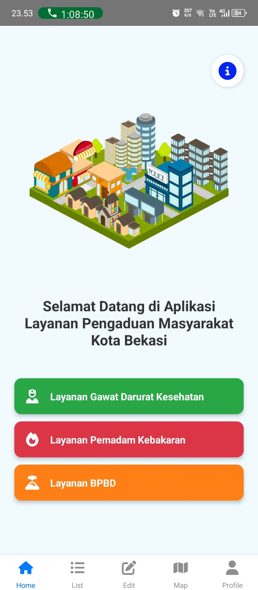
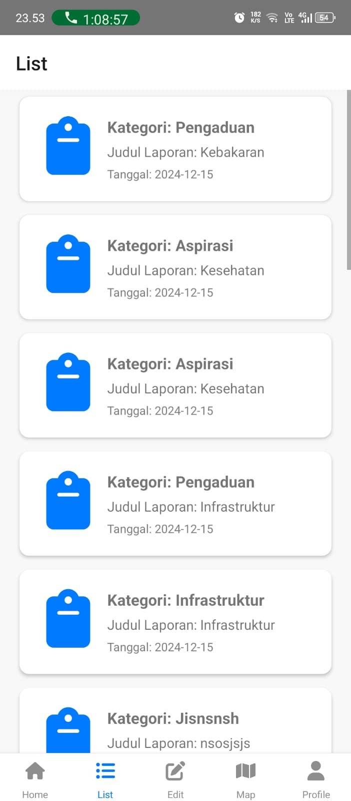
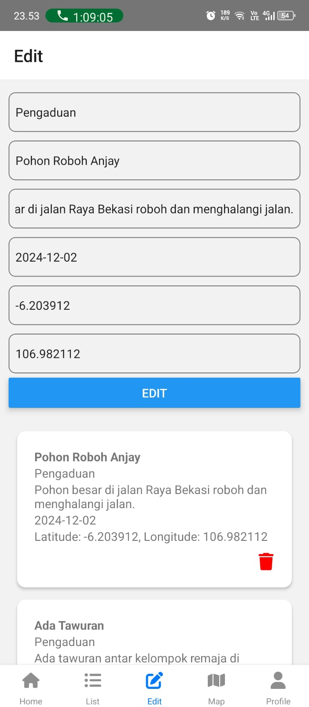
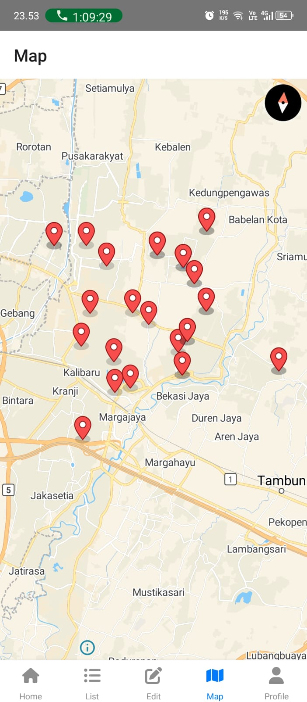

# BeCare (BekasiCare)

## Deskripsi Produk
**BeCare (Bekasi Care)** adalah aplikasi pengaduan yang memungkinkan masyarakat Kota Bekasi untuk melaporkan berbagai permasalahan yang mengganggu kenyamanan kota. Aplikasi ini dirancang untuk menampung pengaduan terkait masalah sosial, kesehatan, ekonomi, dan berbagai isu lainnya yang terjadi di Kota Bekasi. 

Tujuan utama dari aplikasi ini adalah untuk membantu pemerintah Kota Bekasi dalam menangani dan menyelesaikan permasalahan yang dihadapi oleh warganya. Selain itu, BeCare dilengkapi dengan fitur GIS (Geographic Information System), yang memungkinkan laporan pengaduan ditampilkan dalam bentuk peta interaktif. Setiap pengaduan akan terhubung dengan titik lokasi yang mempermudah pemantauan dan penanganan oleh pihak berwenang.

## Komponen Pembangun
- **React Native**: Framework untuk membangun aplikasi mobile berbasis JavaScript.
- **JSON Server**: Digunakan sebagai server untuk menampung dan mengelola data sementara.
- **FontAwesome**: Digunakan untuk menampilkan ikon-ikon di dalam aplikasi.
- **MapLibre**: Digunakan untuk menyediakan peta interaktif dalam aplikasi menggunakan BaseMap.

## Sumber Data
- **BaseMap** dari Map Libre
- **Icon** dari FontAwesome

## Tangkapan Layar Komponen Penting Produk
- {:width="300px"}
- {:width="300px"}
- {:width="300px"}
- {:width="300px"}
- {:width="300px"}

## Instalasi dan Penggunaan
1. Clone repository ini:
   ```bash
   git clone https://github.com/username/BeCare.git
