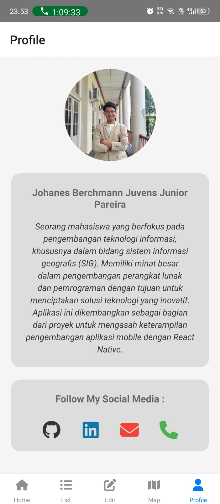

# BeCare (BekasiCare)

## Deskripsi Produk
**BeCare (Bekasi Care)** adalah aplikasi pengaduan yang memungkinkan masyarakat Kota Bekasi untuk melaporkan berbagai permasalahan yang mengganggu kenyamanan kota. Aplikasi ini dirancang untuk menampung pengaduan terkait masalah sosial, kesehatan, ekonomi, dan berbagai isu lainnya yang terjadi di Kota Bekasi. 

Tujuan utama dari aplikasi ini adalah untuk membantu pemerintah Kota Bekasi dalam menangani dan menyelesaikan permasalahan yang dihadapi oleh warganya. Selain itu, BeCare dilengkapi dengan fitur GIS (Geographic Information System), yang memungkinkan laporan pengaduan ditampilkan dalam bentuk peta interaktif. Setiap pengaduan akan terhubung dengan titik lokasi yang mempermudah pemantauan dan penanganan oleh pihak berwenang.

## Komponen Pembangun
- **React Native**: Framework untuk membangun aplikasi mobile berbasis JavaScript.
- **JSON Server**: Digunakan sebagai server untuk menampung dan mengelola data sementara.
- **FontAwesome**: Digunakan untuk menampilkan ikon-ikon di dalam aplikasi.
- **MapLibre**: Digunakan untuk menyediakan peta interaktif dalam aplikasi menggunakan BaseMap.

## Sumber Data
- **BaseMap** dari Map Libre
- **Icon** dari FontAwesome

## Tangkapan Layar Komponen Penting Produk
 Pada Home Page, pengguna akan melihat tampilan awal aplikasi yang menyediakan beberapa tombol untuk mengakses layanan darurat, seperti layanan kesehatan, pemadam kebakaran, polisi, dan badan penanggulangan bencana. Selain itu, terdapat tombol informasi yang menjelaskan tujuan dan kegunaan aplikasi ini.
 List Page menampilkan daftar laporan pengaduan yang telah diajukan oleh pengguna. Di halaman ini, pengguna dapat melihat status dan detail pengaduan yang telah dilaporkan.
 Pada Edit Page, pengguna dapat melakukan perubahan atau pembaruan laporan pengaduan. Jika laporan sudah selesai ditangani, pengguna juga dapat menghapus laporan tersebut.
 Di Map, pengguna akan melihat peta yang menampilkan sebaran marker dari laporan yang telah dibuat. Pengguna dapat menambahkan laporan baru dengan menekan lokasi di peta yang sesuai dengan masalah yang ingin dilaporkan.
 Profil menampilkan informasi mengenai pembuat aplikasi, memberikan gambaran tentang pengembang dan latar belakang proyek ini.

## Instalasi dan Penggunaan
1. Clone repository ini:
   ```bash
   git clone https://github.com/username/BeCare.git
